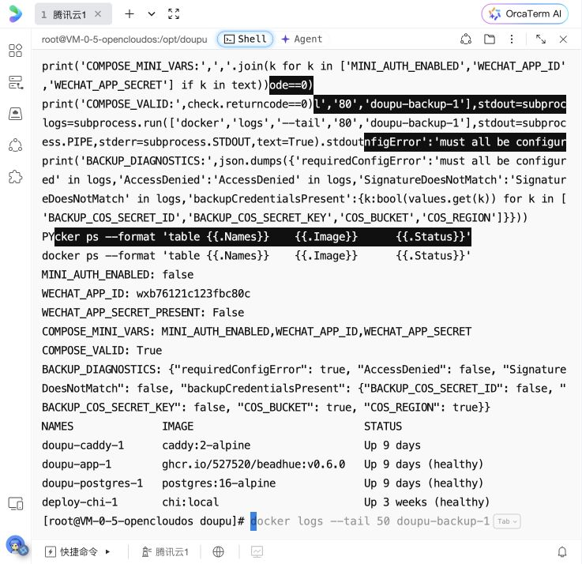
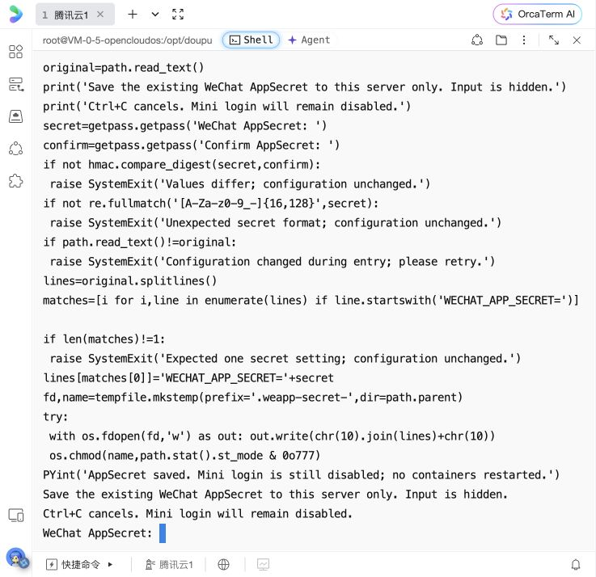

# 2026-10-07 生产服务器接入准备

用户已在侧边浏览器连接腾讯云 OrcaTerm，并授权继续完成小程序接入设置。代理通过该已有终端操作，没有另建 SSH 凭据。

## 已核实的线上状态

- 当前 root 会话位于 `/opt/doupu`，站点 `APP_URL=https://beadhue.com`、`SITE_DOMAIN=beadhue.com`。
- app 镜像为 `ghcr.io/527520/beadhue:v0.6.0`，app、PostgreSQL、另一应用 chi 均健康；Caddy 运行。服务器未安装 git，生产采用已发布镜像。
- 运行中的 app 路由清单没有 `/api/mini/`，没有正文 WOFF 文件，没有微信 AppID/AppSecret 环境。原版上线镜像不能视为小程序兼容已部署。
- 使用 `BEGIN READ ONLY` 核查数据库：`wechat_bindings` 不存在，`sessions.client_type` 不存在；最新 Drizzle 迁移 id=22、journal timestamp=1790260605360。没有执行生产迁移或业务写入。
- `doupu-backup-1` 已以 exit=1 退出；日志确认必填配置缺失，服务器没有 BACKUP_COS_SECRET_ID/KEY，COS_BUCKET/REGION 存在。没有读取或输出任何秘密值，没有用应用密钥替代专用备份密钥。

## 已完成的服务器变更

在 `/opt/doupu/.env` 中补齐尚不存在的字段：

```dotenv
MINI_AUTH_ENABLED=false
WECHAT_APP_ID=wxb76121c123fbc80c
WECHAT_APP_SECRET=
```

在 `/opt/doupu/docker-compose.prod.yml` 的 app.environment 中补齐对应三项显式注入。先以临时配置执行 `docker compose config --quiet`，通过后原子替换；保持文件权限、所有既有配置值、Compose 名、镜像、网络、数据库和云资源。

重新读取实际文件确认 AppID、关闭的开关、空 Secret 以及三项容器变量，Compose 再次校验通过。没有重启容器、切流、替换镜像、迁移数据库或上传小程序。



## 已准备的密钥输入交接

侧边浏览器的服务器终端已停在 `WeChat AppSecret:` 提示。用户可从该小程序后台获取现有 AppSecret，直接粘贴并 Enter，再在 `Confirm AppSecret:` 重复一次；不会回显输入。两次相同且格式有效才保存到该服务器 `.env`；不发送到聊天、不进入 shell 历史或仓库。输入期间若原配置被其他人修改则拒绝覆盖。可 Ctrl+C 取消。

保存后登录开关仍关闭，也不会重启容器。代理之后只核查密钥是否存在，不读取具体值。



## 微信后台的明确阻塞

此前浏览器工具对 `mp.weixin.qq.com` 已明确返回站点安全策略禁止操作，并禁止其他浏览器、原生应用、CDP、脚本等绕过。本轮没有重新尝试被禁止操作。用户登录不解除该策略。

因此用户需在微信后台添加 request 合法域名 `https://beadhue.com`，并完成必要的管理员扫码；现有 AppSecret 由用户取得并在上述隐藏提示中安全配置。当前后台域名与备案状态仍未知。开发者工具此前已实测 `url not in domain list`，没有关闭校验。

## 发布与 CI 状态（通过 GitHub connector 只读核验）

- 远端 main=`9a95b456`，feat/wechat-personal=`ba8257ae`；最新本地 dd71dcf1/7abf287f 尚未推送。当前 feature 没有 PR，也没有工作流或提交检查记录。
- [2026-10-05 main CI](https://github.com/527520/beadhue/actions/runs/37297231674) 失败：Firefox 裁剪后卡在「保存中…」而超时；另一轮 Firefox 整体18分钟超时，仅能把最后位置推断到官方批次用例；另有 Next/Nodemailer 生产依赖审计失败。它们运行旧 main，不能归因于未进入远端的小程序分支。
- [旧 v0.6.0 release](https://github.com/527520/beadhue/actions/runs/36302896945) 的镜像构建/推送成功，后续 Trivy 扫描失败，总体不全绿；该镜像不含小程序实现。
- 当前锁文件只读 audit 也仍失败：按 CI 范围为4 critical、16 high、8 moderate；Web 单独范围（workspaces=false）为1 critical、5 high。包含 Next.js、Nodemailer 和若干传递依赖，详见 `evidence/devtools-20261007/dependency-audit-readonly.json`。本轮没有安装或升级依赖；审计结果不是生产已被利用的证据。
- 候选版本仍需按现有受保护 main、CI、版本递增及真实设备/算法证据流程发布；不能把模拟器证据冒充真机证据或绕过门禁在生产从任意源码重建。

服务器连接条件已解决。下一步是用户完成受工具策略限制的微信后台域名与密钥输入，代理继续集成代码、准备可靠备份、候选版本验证、后端部署及真实联调。备案和真机相关的本人操作仍按真实状态逐项核验，尚不具备正式发布条件。
